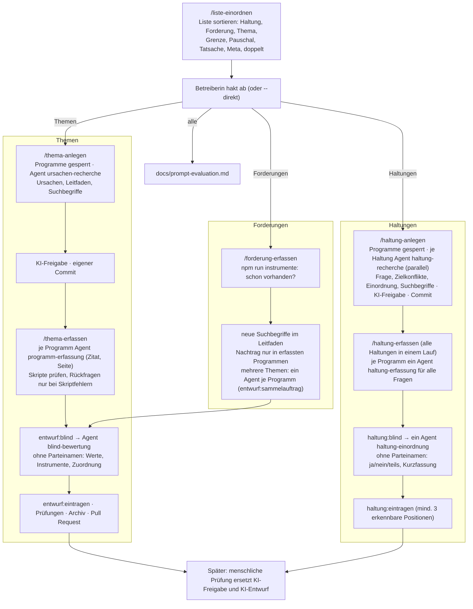

# Ablauf der Skills und Agenten

Die Skills bauen den Katalog für die **geschlossene Testphase** auf: alles als KI-Entwurf mit KI-Freigabe (`"freigabe": { "art": "ki" }`), ohne menschliche Prüfschritte unterwegs. Menschen prüfen danach (Bewertung in der App, Belegprüfung, blinde Einordnung der Haltungen – `daten/README.md` → „Prüfung“); erst dann wird etwas öffentlich.

## Was die Neutralität sichert (auch ohne menschliche Prüfung)

| Sicherung | Wie |
|---|---|
| Ursachen und Fragen vor den Programmen | Phase A mit Programmsperre (`npm run phase-a`, Hook `.claude/hooks/sperre.mjs`); eigener Commit mit KI-Freigabe, bevor erfasst wird – `daten:id --gegen` prüft das am Commit-Verlauf |
| Gleiche Suche für alle | Suchbegriffe und Leitfaden je Thema bzw. Haltung, für alle Programme gleich, von Skripten gezählt; kein Suchbegriff darf in einem Parteinamen stecken („bündnis“ träfe sonst zwei Programme auf fast jeder Seite – `daten:pruefen` und `pruefeLeitfaden` melden das). Doppelt gezeichneter Fettdruck wird beim Auslesen zusammengeführt (`seitenTexte`), sonst fände die Suche dort nichts |
| Belegte Zitate | Jeder Erfassungs-Agent prüft sein Zitat gegen die PDF-Seite (`entwurf:programm-pruefen`, `haltung:programm-pruefen`); `zitate:pruefen` in der CI |
| Urteil ohne Parteinamen | `blind-bewertung` und `haltung-einordnung` sehen nur neutralisierte Listen; der Hook sperrt ihnen alles andere |
| Keine Eingriffe der Koordination | Sie liest keine Programme und vergibt keine Werte; Rückfragen nur bei Skriptfehlern und im Protokoll |
| Fehlende Daten kosten nichts | Nicht durchsuchte Programme bleiben „noch nicht erfasst“, nie „keine Maßnahme“ |

## Sparsam

- Skripte statt Agenten, wo es geht (zählen, Fundstellen, Zitate, Zusammenführen, Bericht).
- Keine inhaltlichen Rückfragen, keine Nachrecherche der Koordination, eine Runde für die Suchbegriffe.
- Bund und Länder in einem Durchgang, mehrere Themen oder Haltungen je Aufruf.
- Modelle fest in den Agentenbeschreibungen: Erfassung `sonnet`, Recherche, Bewertung und Einordnung `opus`. Die Koordination startet vor allem Skripte und kann deshalb mit `sonnet` laufen, ohne dass sich Urteile ändern.
- Kurze Überblicke: `themen:ueberblick -- --kurz` (eine Zeile je Thema) und `-- --haltungen` (ID und Frage) statt ganzer Dateien.
- Forderungen gebündelt: mehrere Themen in einem `/forderung-erfassen`, ein Erfassungs-Agent je Programm für alle Themen (`entwurf:sammelauftrag`); bewertet wird weiter je Thema.
- Haltungen gebündelt: ein Erfassungs-Agent je Programm und Lauf, ein Einordnungs-Agent am Ende. Höchstens sechs Haltungen je Lauf – mit 15 litt die Qualität (Stellen, die das Thema nur berühren); danach eine Nachprüfung der „keine Aussage“ mit gleichem Hinweis für alle Programme.
- Lange Listen erst sortieren (`/liste-einordnen`), dann nur das Bestätigte anlegen – ein Block je Aufruf, mit `/clear` dazwischen.
- Keine Dokumentpflege außer dem Abschnitt in `docs/perspektiven-ursachen.md` bzw. `docs/haltungen.md`; der Rest steht in Protokoll und Pull Request.

## Grundlage

- Skills: [liste-einordnen](liste-einordnen/SKILL.md), [thema-anlegen](thema-anlegen/SKILL.md), [thema-erfassen](thema-erfassen/SKILL.md), [forderung-erfassen](forderung-erfassen/SKILL.md), [haltung-anlegen](haltung-anlegen/SKILL.md), [haltung-erfassen](haltung-erfassen/SKILL.md)
- Agenten: [ursachen-recherche](../agents/ursachen-recherche.md), [programm-erfassung](../agents/programm-erfassung.md), [blind-bewertung](../agents/blind-bewertung.md), [haltung-recherche](../agents/haltung-recherche.md), [haltung-erfassung](../agents/haltung-erfassung.md), [haltung-einordnung](../agents/haltung-einordnung.md)
- Evaluationen der Erfassung: [thema-erfassen/evals/](thema-erfassen/evals/)
