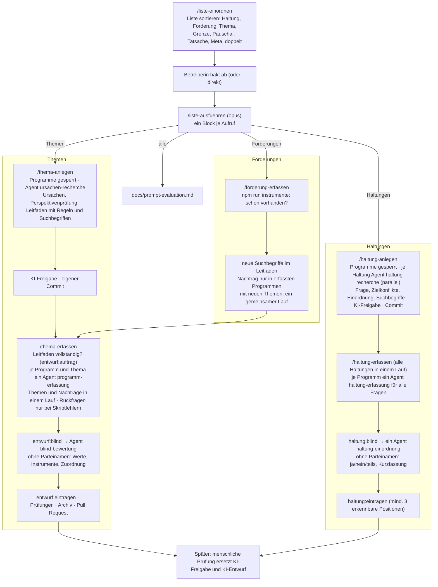

# Ablauf der Skills und Agenten

Die Skills bauen den Katalog für die **geschlossene Testphase** auf: alles als KI-Entwurf mit KI-Freigabe (`"freigabe": { "art": "ki" }`), ohne menschliche Prüfschritte unterwegs. Menschen prüfen danach (Bewertung in der App, Belegprüfung, blinde Einordnung der Haltungen – `daten/README.md` → „Prüfung“); erst dann wird etwas öffentlich.

## Was die Neutralität sichert (auch ohne menschliche Prüfung)

| Sicherung | Wie |
|---|---|
| Ursachen und Fragen vor den Programmen | Phase A mit Programmsperre (`npm run phase-a`, Hook `.claude/hooks/sperre.mjs`); eigener Commit mit KI-Freigabe, bevor erfasst wird – `daten:id --gegen` prüft das am Commit-Verlauf |
| Gleiche Suche für alle | Suchbegriffe und Leitfaden je Thema bzw. Haltung, für alle Programme gleich, von Skripten gezählt; vor dem Erfassen je Ursache eine Regel und Suchbegriffe (`daten:pruefen`, `entwurf:auftrag`) |
| Belegte Zitate | Jeder Erfassungs-Agent prüft sein Zitat gegen die PDF-Seite (`entwurf:programm-pruefen`, `haltung:programm-pruefen`); `zitate:pruefen` in der CI |
| Urteil ohne Parteinamen | `blind-bewertung` und `haltung-einordnung` sehen nur neutralisierte Listen; der Hook sperrt ihnen alles andere |
| Keine Eingriffe der Koordination | Sie liest keine Programme und vergibt keine Werte; Rückfragen nur bei Skriptfehlern und im Protokoll |
| Fehlende Daten kosten nichts | Nicht durchsuchte Programme bleiben „noch nicht erfasst“, nie „keine Maßnahme“ |

## Sparsam

- Skripte statt Agenten, wo es geht (zählen, Fundstellen, Zitate, Zusammenführen, Bericht).
- Keine inhaltlichen Rückfragen, keine Nachrecherche der Koordination, eine Runde für die Suchbegriffe.
- Bund und Länder in einem Durchgang, mehrere Themen oder Haltungen je Aufruf.
- Modelle: Koordination `opus` (plant, startet Skripte und Agenten, prüft kurz nach dem Prüfmuster unten). Fleißarbeit in den Agenten, Modell fest in der Agentenbeschreibung: Recherche (`ursachen-recherche`, `haltung-recherche`) `haiku`; Erfassung aus Programmen `sonnet` (mit `haiku` widersprach im Vergleichstest ein Drittel der Maßnahmen dem Leitfaden, `thema-erfassen/evals/README.md`); Bewertung und Einordnung `opus` – dort muss jeder einzelne Wert stimmen, ein Entwurf mit Prüfung und Nacharbeit kostete dreimal dieselbe Liste. `/liste-einordnen` läuft mit dem Modell der Sitzung.
- Sammelbefehle: `entwurf:lauf -- vorab | auftraege | erfasst | blind | bewertet` erledigt einen Schritt für alle Themen eines Laufs – fünf Aufrufe statt rund 16 je Thema.
- Kurze Überblicke: `themen:ueberblick -- --kurz` (eine Zeile je Thema) und `-- --haltungen` (ID und Frage) statt ganzer Dateien.
- Ein Lauf für alle Themen: mehrere Themen in `/thema-erfassen` und Nachträge aus `/forderung-erfassen` laufen gemeinsam durch die Sammelbefehle, bei mehreren Themen ein Sammelauftrag je Programm (`--sammel`: ein Agent liest das Programm einmal für alle Themen), bis zu sieben gleichzeitig. Gemessen mit den Themen 30 und 33: 24 % weniger Tokens bei gleicher Fundquote (`thema-erfassen/evals/README.md`). Ein früherer Lauf mit Thema 18 (+39 %) gilt als nicht repräsentativ und ist kein Maßstab.
- Bereiche als Hebel-Checkliste: Bündel nach Bereichen (etwa „Verkehr und Antriebe“) erfasst ein Einzelagent oft nur einmal je Bereich (Thema 18: 68 statt 123 Maßnahmen); als `hebel` beantwortet jedes Programm jeden Hebel. `entwurf:auftrag` weist darauf hin, die Selbstprüfung nennt leere Bündel.
- Leitfaden vor dem Lesen vollständig: Fehlt einer Ursache eine Regel, kostet das später eine Rückfrage an jedes Programm (Thema 18: mehr Tokens als die Erfassung selbst).
- Ein Testlauf je Block (`npm test -- --reporter=dot`) am Ende; Phase-A-Schritte prüfen nur mit `daten:pruefen`.
- Haltungen gebündelt: sieben Erfassungs-Agenten und ein Einordnungs-Agent je Lauf, gleich wie viele Haltungen (bis 15); jedes Programm wird einmal gelesen.
- Lange Listen erst sortieren (`/liste-einordnen`), dann nur das Bestätigte anlegen (`/liste-ausfuehren`) – ein Block je Aufruf, mit `/clear` dazwischen.
- Keine Dokumentpflege außer dem Abschnitt in `docs/perspektiven-ursachen.md` bzw. `docs/haltungen.md`; der Rest steht in Protokoll und Pull Request.

## Prüfmuster

Jede Agentenarbeit wird genau einmal geprüft – erst vom Skript, dann vom Urteil, nie doppelt:

1. **Skript** prüft alles Nachrechenbare (Format, Zitat auf der Seite, Quellen, Vollständigkeit). Fehler gehen direkt an denselben Agenten zurück; die Koordination liest sie nicht inhaltlich.
2. **Urteil** (Koordination, Opus) nur dort, wo kein Skript reicht – Recherche-Vorschläge in Phase A: kurz „passt“ oder „passt nicht: <Punkte>“. Bei „passt nicht“ **eine** gebündelte Rückfrage an denselben Agenten, danach ein letztes Urteil; was dann nicht passt, wird verworfen (mit Grund). Die Koordination recherchiert und formuliert nicht selbst.
3. Bei Erfassung und Bewertung ist das Urteil die Bewertung ohne Parteinamen (`blind-bewertung`, `haltung-einordnung`); die Koordination urteilt dort nicht.

Was ein Schritt geprüft hat, prüft kein späterer noch einmal: keine Kontrolle der Agentenergebnisse durch die Koordination nach bestandener Selbstprüfung, keine Aufnahmeprüfung in `/thema-anlegen` für Zeilen aus `/liste-einordnen`, Seed und Tests einmal am Ende eines Pull Requests.

## Grundlage

- Skills: [liste-einordnen](liste-einordnen/SKILL.md), [liste-ausfuehren](liste-ausfuehren/SKILL.md), [thema-anlegen](thema-anlegen/SKILL.md), [thema-erfassen](thema-erfassen/SKILL.md), [forderung-erfassen](forderung-erfassen/SKILL.md), [haltung-anlegen](haltung-anlegen/SKILL.md), [haltung-erfassen](haltung-erfassen/SKILL.md)
- Agenten: [ursachen-recherche](../agents/ursachen-recherche.md), [programm-erfassung](../agents/programm-erfassung.md), [blind-bewertung](../agents/blind-bewertung.md), [haltung-recherche](../agents/haltung-recherche.md), [haltung-erfassung](../agents/haltung-erfassung.md), [haltung-einordnung](../agents/haltung-einordnung.md)
- Evaluationen der Erfassung: [thema-erfassen/evals/](thema-erfassen/evals/)
