# Datenmodell

Stand: Migrationen bis `20261009000000_haltungen.sql` (`supabase/migrations/`).
Die kuratierten Daten liegen als JSON in `daten/`; `npm run seed` erzeugt daraus die `seed.sql`.

## ER-Diagramm

```mermaid
erDiagram
    parteien ||--o{ massnahmen : "hat"
    instrumente |o--o{ massnahmen : "instrument_id"
    themen ||--o{ instrumente : "gehört zu"
    instrumente |o--o| instrumente : "entspricht (Bund ↔ Land)"
    instrumente |o--o{ runden : "instrument_id"
    haltungen ||--o{ haltung_positionen : "hat"
    parteien ||--o{ haltung_positionen : "vertritt"
    haltungen ||--o{ haltung_zielkonflikte : "hat"
    haltungen |o--o{ runden : "haltung_id"
    themen ||--o{ massnahmen : "gehört zu"
    themen ||--o{ ursachen : "hat"
    themen ||--o{ abdeckung : "ist erfasst für"
    parteien ||--o{ abdeckung : "ist erfasst für"
    parteien ||--o{ landesprogramme : "hat"
    laender ||--o{ landesprogramme : "gilt in"
    laender |o--o{ massnahmen : "land (null = Bund)"
    laender |o--o{ abdeckung : "land (null = Bund)"
    themen |o--o{ runden : "thema_id"
    parteien |o--o{ runden : "partei_a / partei_b"
    themen ||--o{ pruef_einheiten : "gehört zu"
    pruef_einladungen ||--o{ pruef_bewertungen : "gibt ab"

    parteien {
        smallint id PK
        text name
        text kurzname
        text farbe
        text programm_url
        date programm_stand
    }
    themen {
        smallint id PK
        text name
        text beschreibung
    }
    ursachen {
        smallint id PK
        smallint thema_id FK
        text beschreibung
        text quelle_url
        text ebene "bund | land"
    }
    massnahmen {
        serial id PK
        smallint thema_id FK
        smallint partei_id FK
        text land FK "null = Bundesprogramm"
        text beschreibung
        smallint_arr ursachen_ids "Verweis auf ursachen.id"
        integer instrument_id FK "gleicher Lösungsweg wie in anderen Programmen"
        smallint wirksamkeit "0-3"
        smallint umsetzbarkeit "0-3"
        jsonb rollen_modifikator
        text begruendung
        text beleg_programm_url
        text beleg_studie_url
        text evidenz "belegt | gemischt | offen"
        date stand
        boolean geprueft
        boolean ki_entwurf
    }
    instrumente {
        integer id PK "Nummernkreis wie Maßnahmen"
        smallint thema_id FK
        text name
        text begruendung
        text evidenz "belegt | gemischt | offen"
        text beleg_studie_url
        text ebene "bund | land"
        integer entspricht FK "gleicher Lösungsweg auf der anderen Ebene"
        boolean ki_entwurf
        text entwurf_herkunft "blind | nicht_blind"
    }
    abdeckung {
        smallint thema_id FK
        smallint partei_id FK
        text land FK "null = Bund"
        text art "massnahmen | keine"
        text begruendung
        date stand
        boolean ki_entwurf
        integer_array durchsucht_fuer "null = alle Ursachen"
    }
    laender {
        text id PK "z. B. ST"
        text name
        date letzte_wahl
    }
    landesprogramme {
        smallint partei_id PK
        text land PK
        text url
        date stand
        text kein_programm
    }
    runden {
        bigint id PK
        timestamptz created_at
        smallint thema_id FK
        integer instrument_id FK "nur bei status forderung"
        smallint haltung_id FK "nur bei status wert"
        text problem_text
        smallint partei_a FK
        smallint partei_b FK
        smallint punkte_a
        smallint punkte_b
        text status "gewertet | ungeprueft | unvollstaendig | wert | forderung | grenze"
        boolean freigegeben
        boolean testphase
    }
    haltungen {
        smallint id PK "eigener Nummernkreis"
        text frage "neutrale Ja/Nein-Frage"
        text beschreibung
        smallint_arr verwandte_themen "Verweis auf themen.id"
    }
    haltung_positionen {
        smallint haltung_id FK
        smallint partei_id FK
        text land FK "null = Bund (zunächst nur Bund)"
        text position "ja | nein | teils | keine_aussage"
        text kurzfassung
        text zitat "wörtlich, bei Haltungen der Beleg"
        text beleg_programm_url
        text begruendung "nur bei keine_aussage"
        date stand
        boolean ki_entwurf
    }
    haltung_zielkonflikte {
        int id PK
        smallint haltung_id FK
        text seite "ja | nein"
        text text
        text quelle_url
    }
    review_warteschlange {
        bigint id PK
        text problem_text
        text einschaetzung
        boolean erledigt
    }
    review_eingaben {
        bigint id PK
        text grund "grenze | wert | forderung | ungeprueft | unvollstaendig"
        text_arr eingaben "Wortlaut, nur Admins, max. 30 Tage"
        smallint thema_id FK
        text zusammenfassung
    }
    rate_limit {
        uuid sitzung PK
        timestamptz fenster_start
        int anzahl
    }
    pruef_einladungen {
        uuid id PK
        text token_hash
        text name
        smallint_arr themen
        boolean gesperrt
        timestamptz einwilligung_am
    }
    pruef_bewertungen {
        uuid einladung_id PK
        int massnahme_id PK
        smallint thema_id
        smallint wirksamkeit
        smallint umsetzbarkeit
        boolean abgesendet
    }
    pruef_einheiten {
        int id PK
        smallint thema_id FK
    }
    testphase_zugaenge {
        uuid id PK
        text token_hash
        text name
        boolean gesperrt
    }
    admins {
        uuid user_id PK
    }
```



`massnahmen.ursachen_ids` ist ein Array und daher keine echte Fremdschlüsselbeziehung.
`instrumente` enthält bewusst keine Wirksamkeit und Umsetzbarkeit: Die Forderungskarte zeigt Forschungsstand und Begründung, aber keine Punkte; gewertet wird weiter über die Maßnahmen. Ein Instrument gilt für eine Ebene; `entspricht` verbindet das Bundes- mit dem Landes-Instrument desselben Lösungswegs.
`pruef_bewertungen.massnahme_id` verweist auf IDs aus `daten/`, nicht zwingend auf `massnahmen`.
`haltungen.verwandte_themen` ist ein Array und daher keine echte Fremdschlüsselbeziehung. Haltungen haben keine Punkte; anders als bei Maßnahmen steht das Zitat in der Datenbank, weil bei Haltungen der Wortlaut der eigentliche Beleg ist. Die View `haltungen_vollstaendig (haltung_id, geprueft)` nennt die Haltungen, zu denen jede Partei eine Position im Bundesprogramm hat („Alle sieben oder keine“); sie läuft mit den Rechten der Abfragenden, öffentlich zählen also nur geprüfte Positionen. Die Edge Function sieht mit der Service-Rolle auch Entwürfe und nimmt ohne Testphase nur Zeilen mit `geprueft`. Die App nutzt dieselbe Regel (`supabase/functions/_shared/haltung.ts`).
Die Views `luecken` und `kennzahlen_woche` zählen Runden aus `runden` für den Reiter „Lücken“ der Admin-Ansicht: `luecken (art, thema_id, stichwort, anzahl_30_tage, anzahl, anzahl_testphase, zuletzt)` je Thema bzw. Stichwort, wo das Spiel keine Wertung oder Karte liefern konnte; `kennzahlen_woche (woche, testphase, runden, gewertet, …)` je Woche und Status. Nur Zahlen, kein Wortlaut, deshalb ohne 30-Tage-Frist; nur Admins (`security_invoker` und `ist_admin()`), anon gesperrt.

## Gruppen

| Gruppe | Tabellen | Zugriff |
|---|---|---|
| Stammdaten | `parteien`, `themen`, `laender`, `landesprogramme` | lesbar |
| Kern | `ursachen`, `massnahmen`, `abdeckung`, `instrumente`, `haltungen`, `haltung_positionen`, `haltung_zielkonflikte` | lesbar; ohne KI-Entwürfe, außer in der Testphase |
| Spieldaten | `runden`, `review_warteschlange`, `review_eingaben`, `rate_limit` | schreibbar nur über Edge Function |
| Auswertung | Views `luecken`, `kennzahlen_woche` | nur Admins |
| Betrieb | `admins`, `pruef_*`, `testphase_zugaenge` | anon gesperrt; Admins und Edge Functions |

## Bund oder Land?

- `massnahmen.land IS NULL` → Bundesprogramm; sonst Landtagswahlprogramm dieses Landes.
- `abdeckung.land` gilt genauso.
- `ursachen.ebene` sagt, wer für die Ursache zuständig ist. Das ist etwas anderes als die Herkunft der Maßnahme.

```sql
select id, partei_id,
       case when land is null then 'Bund' else 'Land: ' || land end as ebene,
       beschreibung
from massnahmen
order by land nulls first, partei_id;
```

## Ablauf einer Wertung

1. Die KI ordnet das Problem Thema und Ursachen zu.
2. `abdeckung` prüfen. Fehlt ein Eintrag für eine der Parteien, ist der Status `unvollstaendig` und es gibt keine Punkte.
3. Je Ursache zählen die verschiedenen Lösungswege (je `instrument_id` die beste Maßnahme, ohne Instrument jede Maßnahme für sich; Punkte `wirksamkeit × umsetzbarkeit` mit Rollen-Modifikator), absteigend gewichtet mit 1, ½, ¼ …, höchstens 9, auf eine Nachkommastelle (`runden.punkte_a/b` sind `numeric(5,1)`). Bei gewähltem Land zählen die Landesprogramme, sonst der Bund.
4. Die Summe über die Ursachen ergibt die Rundenpunkte. Wer mehr hat, bekommt 1 Punkt, bei Gleichstand beide 1 Punkt. Das Ergebnis steht in `runden`.
