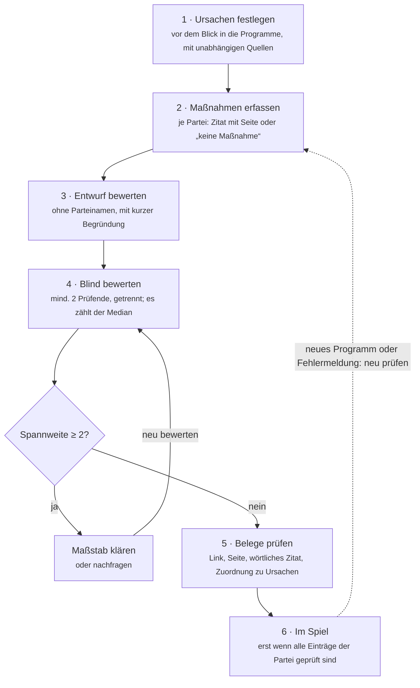

# Politik-Duell – Methodenpapier

Stand: 2. 10. 2026

*Versprechen kann jeder.* Das Politik-Duell vergleicht Parteien daran, ob sie für reale Alltagsprobleme wirksame und umsetzbare Lösungen anbieten – nach denselben Regeln für alle und mit Beleg für jede Bewertung.

## Worum es geht

Das Politik-Duell ist ein Spiel für zwei Personen. Jede wählt eine Partei. In fünf Runden nennen beide abwechselnd ein Problem aus ihrem Alltag, etwa „Ich finde keinen Facharzttermin“ oder „Meine Miete frisst mein halbes Gehalt“. Das Spiel zeigt dann, welche der beiden Parteien dafür die wirksamere und umsetzbare Lösung im Programm hat. Zu jeder Bewertung gibt es den Beleg: einen Link auf die Seite im Wahlprogramm.

Das Ziel: Politik an dem messen, was sie für konkrete Probleme vorschlägt, nicht an Versprechen, Sympathie oder Lautstärke. Das Spiel ist keine Wahlempfehlung und kein Gesamturteil über eine Partei.

## Grundprinzipien

Fünf Regeln gelten ohne Ausnahme:

1. **Neutrale Methode, kein vorgegebenes Ergebnis.** Alle Parteien werden nach denselben Kriterien bewertet. Bietet eine Partei nachweislich die beste Lösung, gewinnt sie – egal welche.
2. **Die KI vergibt keine Punkte.** Sie führt nur das Gespräch und ordnet ein Problem einem Thema und seinen Ursachen zu. Die Punkte kommen immer aus einer geprüften Datenbank.
3. **Jede Bewertung hat einen Beleg.** Quellen und Links stammen nur aus der Datenbank, die KI erfindet keine. Jede Maßnahme ist mit wörtlichem Zitat und Seitenangabe im Wahlprogramm belegt.
4. **Forderung ist nicht gleich Problem.** Sagt jemand „weniger X“, fragt das Spiel nach dem konkreten Alltagsproblem dahinter. Bewertet wird die Lösung für das Problem, nicht die Forderung.
5. **Datenschutz.** Politische Meinungen sind besonders geschützte Daten (Art. 9 DSGVO). Es gibt keine Konten, es werden keine IP-Adressen und keine Sprachaufnahmen gespeichert, nur der anonyme Problemtext.

## Datengrundlage

Grundlage sind die Wahlprogramme zur Bundestagswahl 2025 von sieben Parteien. Neuere Grundsatzprogramme gibt es bisher nicht (Stand September 2026); kommt eines hinzu, werden alle älteren Einträge der Partei neu geprüft.

**Landesprogramme:** Für Ursachen, für die vor allem die Länder zuständig sind – etwa Lehrkräfte oder Schulgebäude –, zählt das Wahlprogramm der Partei zur Landtagswahl, sofern es aus der **laufenden Wahlperiode** des Landtags stammt. Spielende können dafür optional ihr Bundesland wählen. Mehr dazu unter „Bund und Länder“. Erfasst werden zuerst die Programme zu den Landtagswahlen 2026 in Sachsen-Anhalt, Mecklenburg-Vorpommern und Berlin; ein Land steht im Spiel zur Wahl, sobald dafür geprüfte Einträge vorliegen.

| Partei | Wahlprogramm | Beschluss |
| --- | --- | --- |
| CDU/CSU | [Politikwechsel für Deutschland](https://www.cdu.de/app/uploads/2025/01/km_btw_2025_wahlprogramm_langfassung_ansicht.pdf) | 17. 12. 2024 |
| SPD | [Mehr für Dich. Besser für Deutschland.](https://www.spd.de/fileadmin/Dokumente/Beschluesse/Programm/2025_SPD_Regierungsprogramm.pdf) | 11. 1. 2025 |
| Bündnis 90/Die Grünen | [Zusammen wachsen](https://cms.gruene.de/uploads/assets/20250318_Regierungsprogramm_DIGITAL_DINA5.pdf) | 26. 1. 2025 |
| FDP | [Alles lässt sich ändern](https://www.fdp.de/sites/default/files/2024-12/fdp-wahlprogramm_2025.pdf) | 9. 2. 2025 |
| AfD | [Zeit für Deutschland](https://www.afd.de/wp-content/uploads/2025/02/AfD_Bundestagswahlprogramm2025_web.pdf) | 12. 1. 2025 |
| Die Linke | [Alle wollen regieren. Wir wollen verändern.](https://www.die-linke.de/fileadmin/user_upload/Wahlprogramm_Langfassung_Linke-BTW25_01.pdf) | 18. 1. 2025 |
| BSW | [Unser Land verdient mehr!](https://bsw-vg.de/wp-content/themes/bsw/assets/downloads/BSW%20Wahlprogramm%202025.pdf) | 12. 1. 2025 |

### Themen: was Menschen selbst nennen

Welche Themen ins Spiel kommen, richtet sich nach den meistgenannten Problemen in Umfragen vor den Landtagswahlen 2026 in Sachsen-Anhalt, Mecklenburg-Vorpommern und Berlin – nicht nach den Schwerpunkten einzelner Parteien. Daraus ergeben sich zehn Themen: Arzttermine, Miete, Energiepreise, Schule, Arbeitsplätze, Zuwanderung und Integration, Rente, Bus und Bahn, Sicherheit, Pflege. Dazu kommen sechs Themen zu bundesweit häufig genannten Belastungen, die noch keine Ursache abdeckte: Preise und Löhne, Straßen und Brücken, Internet und Mobilfunk, Behördengänge, Autofahren, Heizungstausch. Als siebzehntes Thema kam Kita-Betreuung hinzu, als achtzehntes Hitze und Unwetter. Details: [`daten/README.md` → Themenauswahl](../daten/README.md#themenauswahl).

### Ursachen: festgelegt, bevor jemand in die Programme schaut

Jedes Thema hat ein **Ziel aus Sicht der Betroffenen** (Miete: „Mieterinnen und Mieter finden eine passende Wohnung und können sich die Miete dauerhaft leisten.“) und eine Liste von **Ursachen**, warum das Problem besteht. Jede Ursache braucht eine unabhängige Quelle, etwa Statistisches Bundesamt, Sachverständigenräte, IAB, DIW oder BKA. Parteiquellen sind ausgeschlossen, Lobbyverbände nie als einzige Quelle.

Die Ursachen werden in einem eigenen Schritt festgelegt, **bevor** Maßnahmen aus den Programmen erfasst werden. So kann niemand die Ursachen passend zu einem Programm zuschneiden.

Die Ursachenliste entscheidet mit, welche Lösungen überhaupt Punkte bekommen können. Sie ist deshalb die empfindlichste Stelle der Methode. Vier Regeln sollen verhindern, dass sie einseitig wird:

1. **Lösungsoffen formulieren.** Eine Ursache beschreibt, *was* schiefläuft, nicht, *wie* es zu beheben ist. „Zahl der Neuankommenden und Kapazitäten vor Ort passen nicht zusammen“ lässt Lösungen auf beiden Seiten zu (weniger Zugang oder mehr Kapazität); „zu wenige Unterkünfte“ ließe nur eine zu.
2. **Quellen aus unterschiedlichen Richtungen.** Für jedes Thema werden Institute und Gremien unterschiedlicher Ausrichtung herangezogen, etwa arbeitgebernahe und gewerkschaftsnahe Forschung, und amtliche Statistik. Gemeinsame Studien solcher Institute sind besonders geeignet.
3. **Perspektivenprüfung.** Vor der Erfassung von Maßnahmen wird geprüft, ob die in der öffentlichen und fachlichen Debatte vertretenen Problemdiagnosen in mindestens einer belegten Ursache vorkommen. Grundlage sind Fachquellen, nicht die Wahlprogramme. Eine Diagnose, die sich nicht unabhängig belegen lässt, wird nicht aufgenommen – gleich, wer sie vertritt. Die Prüfung wird mit Ergebnis und verworfenen Kandidaten festgehalten ([`docs/perspektiven-ursachen.md`](perspektiven-ursachen.md)).

4. **In alle Richtungen suchen.** Beim Erfassen der Maßnahmen bekommt jede Lösungsrichtung, die die Perspektivenprüfung nennt, eigene Suchbegriffe – dieselben für alle Parteien. Wer nur nach den Stichwörtern einer Richtung sucht, findet nur deren Maßnahmen, und die übrigen Parteien gehen leer aus, obwohl ihr Programm etwas dazu enthält. Die Treffer jedes Begriffs werden in allen Programmen gezählt; hat ein Programm Fundstellen (Seiten, auf denen mehrere verschiedene Begriffe einer Ursache zugleich treffen), aber keine Maßnahme, wird nachgelesen – gleich für alle Programme und in einer einzigen Nachfragerunde. Begriffe, die in einem Programm auf mindestens einem Fünftel der Seiten stehen, zählen nicht für diese Hinweise. Findet sich zu einer genannten Richtung keine Maßnahme, wird das ausdrücklich festgehalten.

**Abgrenzung.** Grenzt eine Ursache an ein breites Politikfeld oder überschneidet sie sich mit einer anderen, legt die Betreiberin beim Festlegen der Ursachen fest, welche Arten von Zusagen für sie zählen und welche nicht. Das gilt für alle Parteien gleich, steht in der Themendatei (`abgrenzung`), wird mit den Ursachen freigegeben und danach nicht mehr geändert. Ohne diese Grenze würde sie erst beim Erfassen gezogen – dann kennt der Koordinator die Programme, und dieselbe Zusage könnte bei einer Partei zählen und bei einer anderen nicht. Grenzfälle, die erst beim Erfassen auffallen, entscheidet der Koordinator einmal an einem Pilot aus zwei Programmen, hält sie als allgemeine Regel ohne Parteinamen fest (`regeln` der Erfassung) und nennt sie im Pull Request.

**Welche Quellen zählen.** Amtliche Statistik und begutachtete Studien immer. Forschungsinstitute auch, wenn sie einer Seite nahestehen – dann wird die Ausrichtung genannt. Stiftungen, Thinktanks, Verbände und Ministerien zählen nur mit eigenen Daten; die Ursache braucht dann eine zweite Quelle. Parteien, Fraktionen und parteinahe Stiftungen zählen nie.

**Belegstufen.** A – amtliche Messung; B – repräsentative Befragung oder begutachtete Studie; C – Einschätzung, Prognose oder Verbandsangabe. A oder B reicht allein, C nur zusammen mit einer zweiten Quelle aus A oder B. Das gilt gleich für aufgenommene und für verworfene Diagnosen.

**Das Ziel ist der Maßstab.** Gemessen wird an ihm, nicht an einzelnen Ursachen. Es wird deshalb wie die Ursachen darauf geprüft, dass es keinen Lösungsweg vorgibt, und von der Betreiberin mit Datum freigegeben, bevor Maßnahmen erfasst werden.

**Nachträgliche Ursachen** sind die Ausnahme und folgen einem festen Verfahren: Fachquelle, Recherche ohne Zugriff auf die Programme, Freigabe durch eine zweite Person, Neusuche in allen Programmen; bis dahin gilt die Ursache für alle Parteien als „noch nicht erfasst“. Sind mehr als ein Drittel der Ursachen eines Themas nachträglich, wird das ganze Thema neu geprüft.

Mehr Ursachen bedeuten nicht mehr Punkte: Die KI ordnet einem Problem nur die Ursachen zu, die dazu passen.

### Maßnahmen: für jede Partei, mit Zitat

Für jede Partei und jedes Thema gibt es genau einen von zwei Einträgen:

- **Maßnahmen**, die an einer der Ursachen ansetzen, jeweils mit wörtlichem Zitat und Seitenanker im Programm (z. B. `…wahlprogramm.pdf#page=17`), oder
- **„keine Maßnahme“**, mit Angabe, welche Kapitel durchsucht wurden.

**Was als Maßnahme zählt:** jede Zusage, etwas zu tun. Ziele oder Leitbilder ohne Handlung („gute Kitas für alle“) und bloße Prüfaufträge zählen nicht; angezeigt wird dann, dass das Programm das Ziel nennt, aber keine Maßnahme. Wie unbestimmt eine Zusage ist, wirkt nur über die Umsetzbarkeit. Die Länge eines Programms wird nicht herausgerechnet: Gleich gründliche Suche (dieselben Begriffe für jede Lösungsrichtung, gezählt in allen Programmen) und eine ohne Parteinamen bestätigte Zuordnung zu den Ursachen sorgen dafür, dass ausführliche Programme nicht allein durch ihre Länge mehr Punkte holen.

Alle Daten liegen offen als Dateien im Quellcode ([`daten/`](../daten/README.md)). Änderungen sind nachvollziehbar und brauchen immer eine Quelle; eine automatische Prüfung kontrolliert Pflichtfelder, Wertebereiche und dass jeder Beleg ins Programm der richtigen Partei zeigt.

## Bewertung

Jede Maßnahme bekommt zwei Werte von 0 bis 3. Ihre Punkte sind das Produkt, also 0 bis 9:

> Punkte = Wirksamkeit × Umsetzbarkeit

Das Produkt ist Absicht: Eine Maßnahme ohne Wirkung bringt keine Punkte, auch wenn sie leicht umzusetzen wäre – und eine wirksame, die sich nicht umsetzen lässt, ebenso wenig.

| Wert | Wirksamkeit: Wie stark hilft sie den Betroffenen? | Umsetzbarkeit: Ist sie realistisch? |
| --- | --- | --- |
| 0 | hilft nicht: setzt an keiner der erfassten Ursachen an | rechtlich oder finanziell derzeit nicht umsetzbar (z. B. verfassungs- oder EU-rechtswidrig) |
| 1 | hilft kaum: berührt eine Ursache nur am Rand oder lindert nur Folgen | nur mit großen Hürden (z. B. Verfassungsänderung, ungeklärte Finanzierung) |
| 2 | hilft spürbar: setzt an einer Ursache an, deutliche Verbesserung zu erwarten | umsetzbar mit Aufwand oder in mehreren Jahren |
| 3 | hilft stark: setzt direkt an einer Hauptursache an, Wirkung gut belegt | rechtlich möglich, finanziert, in einer Wahlperiode realistisch |

Wirksamkeit misst den Beitrag zum Ziel der Betroffenen; Vor- und Nachteile für andere Gruppen zählen hier nicht. Umsetzbarkeit fragt, ob die Regierung der Ebene, aus deren Programm die Maßnahme stammt – Bund oder Land –, sie in einer Wahlperiode rechtlich und finanziell umsetzen könnte. Ob sie politisch mehrheitsfähig ist, spielt keine Rolle. Zu jeder Bewertung gehört eine Begründung in ein bis zwei neutralen Sätzen: was dafür, was dagegen spricht.

**Stand der Forschung.** Zu jeder Maßnahme wird festgehalten, wie gut ihre Wirkung belegt ist: *belegt* (übereinstimmende Studien oder Erfahrungen anderswo), *gemischt* (Studien kommen zu unterschiedlichen Ergebnissen) oder *offen* (kaum untersucht). Wirksamkeit 3 setzt *belegt* voraus und misst die erwartete Verbesserung für die Betroffenen, nicht, ob eine Zielzahl aus der Quelle genau erreicht wird. Ist die Wirkung umstritten, zeigt das Spiel das an („Wirkung in der Forschung umstritten“) und nennt in der Begründung beide Seiten.

**Verschiedene Wege, ähnliche Punkte.** Für die meisten Probleme gibt es nicht die eine richtige Lösung. Parteien setzen oft an verschiedenen Ursachen an – die eine beim Angebot, die andere bei den Kosten. Weil jede Ursache für sich zählt, können sehr unterschiedliche Programme ähnlich viele Punkte erreichen. Ein Gleichstand ist dann kein Mangel, sondern ein Ergebnis: Beide haben einen tragfähigen Weg.

**Rollen.** Spielende können eine Rolle wählen: Mieter:in, Eigentümer:in, angestellt, selbstständig, Rentner:in, arbeitslos, studierend, vermögend. Wirkt eine Maßnahme für eine Rolle nachweislich deutlich besser oder schlechter, verschiebt sich ihre Wirksamkeit um bis zu zwei Stufen (innerhalb 0 bis 3). Auf 3 hebt eine Rolle sie nur, wenn die Wirkung belegt ist – wie bei jeder Wirksamkeit 3. Jede solche Verschiebung ist einzeln begründet und wird angezeigt.

**Gleicher Vorschlag, gleiche Bewertung.** Schlagen mehrere Programme denselben Lösungsweg vor – etwa ein Handyverbot an Schulen –, wird er einmal bewertet und begründet (als *Instrument* im Datenkatalog). Die Bewertung gilt dann für jede Partei, jedes Land und jede spätere Wahlperiode, in der er vorkommt; nur Zitat und Beleg sind je Programm eigene. Unterscheidet sich ein Vorschlag in einem bewertungsrelevanten Punkt – etwa ein Schulbauprogramm mit Betrag statt ohne –, gilt er als eigener Lösungsweg.

### Punkte in der Runde

1. Pro Ursache zählt die beste Maßnahme einer Partei. Mehrere Maßnahmen zur selben Ursache ergeben keinen Zuschlag – sonst gewänne, wer mehr Einzelforderungen aufschreibt, nicht wer besser ansetzt. Wer mehrere Ursachen angeht, wird über die Summe belohnt.
2. Die Rundenpunkte sind die Summe über alle Ursachen, denen das Problem zugeordnet wurde. Zugeordnet werden nur Ursachen, die sich aus der Schilderung erkennen lassen – nicht vorsorglich alle Ursachen des Themas, sonst gewänne bei vagen Problemen, wer zum Thema die meisten Maßnahmen hat. Ist keine Ursache erkennbar, fragt das Spiel nach, woran es konkret hakt (zusammen mit Nachfragen zu Forderungen höchstens zweimal); bleibt es unklar, wird die Runde nicht gewertet.
3. Die höhere Summe bekommt den Spielpunkt, bei Gleichstand beide.
4. Nach fünf Runden gewinnt, wer mehr Spielpunkte hat. Zusätzlich zeigt jede Runde, welche aller sieben Parteien die beste Lösung hätte.

### Bund und Länder

Jede Ursache ist der Ebene zugeordnet, die vor allem dafür zuständig ist: **Bund** (z. B. Asylverfahren, Bürgergeld) oder **Land** (z. B. Lehrkräfte, Schulgebäude). Welche Ebene eine Ursache hat, wird zusammen mit den Ursachen festgelegt.

| Ursache | Bundesland gewählt | Bundesland nicht gewählt |
| --- | --- | --- |
| Ebene Bund | Bundesprogramm | Bundesprogramm |
| Ebene Land | Landesprogramm der Partei in diesem Land | Bundesprogramm |

Es zählt immer genau ein Programm je Partei und Ursache. So hat keine Partei mehr Chancen, nur weil sie in mehr Ländern aktuelle Programme hat. Als aktuell gilt ein Landesprogramm, solange die Wahlperiode läuft, für die es beschlossen wurde. Ist eine Partei in dem gewählten Land nicht angetreten oder hat sie dort kein Programm der laufenden Wahlperiode, wird die Runde nicht gewertet (wie „noch nicht erfasst“). Das gewählte Bundesland wird nicht gespeichert.

### Sonderfälle

| Lage in der Datenbank | Anzeige im Spiel | Punkte |
| --- | --- | --- |
| Maßnahme zu den Ursachen vorhanden, geprüft | Maßnahme mit Bewertung, Begründung und Belegen | nach Bewertung |
| Maßnahmen zum Thema, aber keine zu diesen Ursachen | „keine Maßnahme zu diesen Ursachen“ | 0 |
| Programm enthält nichts zum Thema, geprüft | „nichts zum Thema im Programm“ + was durchsucht wurde | 0 |
| Thema für diese Partei noch nicht vollständig geprüft, oder das Programm wurde nach einer später ergänzten Ursache noch nicht durchsucht | „noch nicht erfasst“ | Runde wird nicht gewertet |
| Ursache auf Landesebene, Partei hat im gewählten Land kein aktuelles Programm | „kein aktuelles Landesprogramm“ | Runde wird nicht gewertet |
| Thema gar nicht in der Datenbank | „ungeprüft – keine Wertung“, ohne Links; kommt in die Warteschlange für neue Themen | keine |
| Spieler:in nennt einen Wert oder eine Haltung | wird respektvoll als persönliche Haltung benannt; neues Problem möglich | keine |

0 Punkte heißt nur: Im Wahlprogramm mit dem angegebenen Stand steht dazu nichts – nicht, dass sich die Partei nie dazu geäußert hätte. Fehlende Daten kosten keine Partei einen Punkt.

## Rolle der KI

Die KI ist Übersetzerin, nicht Schiedsrichterin. Sie macht aus einem frei formulierten Satz eine Zuordnung zu Thema und Ursachen – mehr nicht.

| Die KI … | Die KI … nicht |
| --- | --- |
| erkennt, ob ein Problem, eine Forderung oder eine Haltung genannt wurde | vergibt Punkte |
| stellt bei Forderungen höchstens zwei Nachfragen nach dem Alltagsproblem | nennt Quellen oder Links |
| ordnet das Problem einem Thema und dessen Ursachen zu | bewertet Parteien oder äußert sich zu ihnen |
| fasst das Problem in einem neutralen Satz zusammen | belehrt oder kommentiert Meinungen |

Technisch abgesichert: Die KI antwortet in einem festen Format, die Antwort wird geprüft (nur IDs aus dem Katalog, keine Links), Parteinamen in KI-Texten werden entfernt. Die Punkte berechnet ein festes Programm aus der Datenbank – dieselbe Eingabe ergibt immer dasselbe Ergebnis.

## Prüfverfahren

Eine Bewertung zählt erst, wenn mindestens zwei unabhängige Prüfende sie bestätigt haben und alle Belege kontrolliert sind. Bis dahin zeigt das Spiel „noch nicht erfasst“.

- **Blind bewerten:** Die Prüfenden sehen keine Parteinamen, die Maßnahmen kommen in gemischter Reihenfolge, und niemand sieht die Werte der anderen. Den Entwurf mit Begründung sehen sie erst nach ihrer eigenen Bewertung.
- **Einmal je Lösungsweg:** Ein Instrument (derselbe Lösungsweg in mehreren Programmen) bewerten die Prüfenden einmal, mit den Formulierungen aus allen Programmen vor Augen; das Ergebnis gilt für alle.
- **Median statt Mittelwert:** Je Maßnahme bzw. Instrument zählt der Median, getrennt für Wirksamkeit und Umsetzbarkeit. Einzelne Ausreißer verschieben das Ergebnis so kaum.
- **Streit wird geklärt, nicht gemittelt:** Liegen zwei Einschätzungen zwei oder mehr Stufen auseinander, wird der Maßstab geklärt, bevor Werte übernommen werden.
- **KI-Entwürfe:** Die Schritte 2 und 3 (Maßnahmen erfassen, Entwurf bewerten) können mit Hilfe einer KI erstellt werden. Solche Entwürfe sind im Datenkatalog als KI-Entwurf gekennzeichnet (`ki_entwurf`) und zählen öffentlich erst nach der menschlichen Prüfung. In der geschlossenen Testphase – nur mit persönlichem Zugangslink – erscheinen sie im Spiel, mit deutlichem Hinweis am Ergebnis, im Endstand und im Teilen-Text („vorläufige KI-Bewertung – noch nicht von Menschen geprüft“). Die Regel „Die KI vergibt keine Punkte“ gilt für das Spiel selbst: Dort werden Punkte immer aus der Datenbank berechnet. Neue Entwürfe entstehen seit 30. 9. 2026 in festen, getrennten Schritten: Die Ursachen recherchiert eine KI ohne Zugriff auf die Programme, verwendet werden sie erst nach menschlicher Freigabe; jedes Programm wird getrennt mit denselben Suchbegriffen durchsucht; die Entwurfswerte vergibt eine KI, die nur die Maßnahmen ohne Parteinamen in gemischter Reihenfolge sieht (Ablauf: [`daten/README.md` → „Mit KI-Agenten“](../daten/README.md#mit-ki-agenten)).
- **Technisch gesicherte Neutralität beim Entwurf:** Während die Ursachen festgelegt werden, sind die Programme gesperrt (auch für Agenten); Partei-, Fraktions- und Stiftungsserver sind für die KI nie abrufbar. Die Liste für die Bewertung enthält keine Parteinamen, Personen oder Länder; verdächtige Restwörter werden gemeldet. Die bewertende KI bestätigt jede Zuordnung einer Maßnahme zu einer Ursache. Ursachen oder Ziel und Maßnahmen desselben Themas dürfen sich nicht im selben Schritt ändern. Werte, die jemand mit Kenntnis der Partei vergeben oder geändert hat, sind als „nicht blind“ gekennzeichnet und erscheinen in der Testphase als „vorläufige Bewertung, nicht blind“.
- **Nachweis der Prüfung:** Als geprüft gilt ein Eintrag nur mit Datum der Belegprüfung, bei „keine Maßnahme“ zusätzlich mit einer dokumentierten zweiten Suche. Die Ergebnisse der Prüfenden liegen ohne Namen im Quellcode; jede übernommene Bewertung wird automatisch dagegen abgeglichen.
- **Zitate automatisch geprüft:** Ein Programm lädt die Wahlprogramme herunter und prüft, ob jedes wörtliche Zitat auf der Seite steht, auf die der Beleg zeigt (`npm run zitate:pruefen`, auch automatisch bei jeder Datenänderung und wöchentlich). Das fängt vor allem ungenaue oder erfundene Zitate ab.
- **Namen nur mit Einwilligung:** Prüfende werden öffentlich nur genannt, wenn sie zustimmen; sonst heißt es „von n unabhängigen Prüfenden“.
- **Korrigierbar:** Fehler kann jede Person melden, mit Link auf die Stelle im Programm. Parteien können ihre Einträge jederzeit prüfen und eine Stellungnahme schicken.

## Grenzen der Methode

Die Methode ist so fair wie möglich, aber nicht fehlerfrei. Wir benennen ihre Grenzen offen:

- **Programme sind nicht Politik.** Bewertet wird, was im Wahlprogramm steht, nicht was eine Partei im Parlament oder in einer Regierung tatsächlich getan hat.
- **Bewerten bleibt Urteil.** Wirksamkeit und Umsetzbarkeit sind Einschätzungen. Blinde Prüfung, Median und offene Begründungen machen sie nachvollziehbar, aber nicht objektiv.
- **Die Ursachenliste prägt das Ergebnis.** Welche Ursachen ein Thema hat, entscheidet mit, welche Maßnahmen zählen. Deshalb werden sie vorab mit unabhängigen Quellen festgelegt, auf verschiedene Perspektiven geprüft und nur in begründeten Ausnahmen ergänzt.
- **Lange Programme haben mehr Fundstellen.** Wir rechnen die Programmlänge nicht heraus, sondern sichern gleich gründliche Suche und gleiche Zuordnung; den Zusammenhang zwischen Länge und Punkten nennen wir je Thema.
- **Belegte Wirkung bevorzugt Erprobtes.** Instrumente, die es schon gibt, sind besser untersucht als neue Ideen. Die Regel „Wirksamkeit 3 nur mit belegter Wirkung“ kann neue Vorschläge daher etwas benachteiligen. Wir nehmen das in Kauf, weil die Alternative wäre, Versprechen ungeprüft zu glauben.
- **Das Bundesland verändert das Ergebnis.** Bei Landesthemen kann dieselbe Partei in zwei Ländern unterschiedlich abschneiden. Das ist gewollt: Landesparteien haben eigene Programme.
- **Ein Spiel ist ein Ausschnitt.** Es deckt fünf Probleme ab und ist kein Gesamturteil über eine Partei – und keine Wahlempfehlung.
- **Die KI kann falsch zuordnen.** Deshalb zeigt jede Runde, welchem Thema und welchen Ursachen das Problem zugeordnet wurde, damit Spielende es nachprüfen können.

## Stand und Mitmachen

Die App läuft als spielbarer Prototyp mit Spracheingabe, KI-Zuordnung, Wortwolke und Datenschutz. Die Daten sind im Aufbau:

| Baustein | Stand September 2026 |
| --- | --- |
| Parteien und Programme | 7 Parteien, Wahlprogramme 2025 erfasst |
| Themen mit belegten Ursachen | 18 Themen |
| Maßnahmen erfasst | 16 Themen, alle 7 Parteien aus den Bundesprogrammen (KI-Entwurf, ungeprüft); Sicherheit wird neu angelegt |
| Landesprogramme | Schule, Zuwanderung und Integration, Pflege (Investitionskosten der Heime), Miete (Sozialwohnungen) sowie Bus und Bahn (Angebot, Fahrpersonal, Ticketpreise): alle 21 Programme zu den Landtagswahlen 2026 in Sachsen-Anhalt, Mecklenburg-Vorpommern und Berlin (KI-Entwurf, ungeprüft) |
| Geprüft und im Spiel | noch keine – das Prüfverfahren startet mit dem Thema Miete |

Wir suchen:

- **Prüfende mit Fachwissen** zu einem der Themen, z. B. Wohnen, Gesundheit, Energie, Rente. Aufwand: etwa 20–30 Minuten je Thema, in der App, ohne Konto.
- **Partnerorganisationen**, die die Methode fachlich begleiten, das Spiel in ihren Netzwerken bekannt machen oder es in der politischen Bildung einsetzen.
- **Hinweise auf Fehler** in Maßnahmen, Zitaten oder Ursachen, immer mit Link auf die Quelle.

**Initiatorin:** [Name], [E-Mail]
