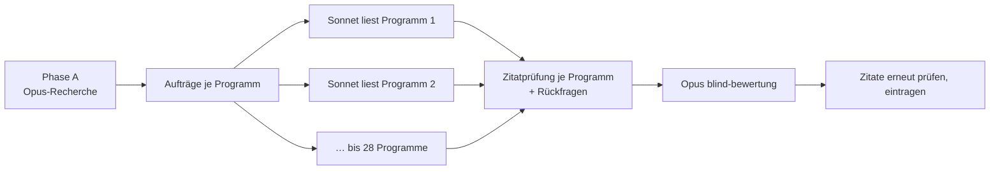
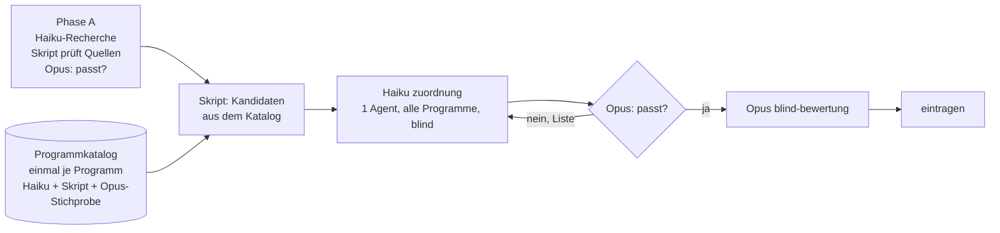

# Plan: Programmkatalog und schlankere Erfassung (Entwurf)

Stand: 2026-10-09 · Konzept, noch nicht umgesetzt.

## Ziel

1. **Jedes Programm wird einmal gelesen.** Danach arbeiten alle Skills (Themen, Forderungen, Haltungen) mit dem Katalog statt mit dem PDF.
2. **Rollen:** Opus plant, koordiniert und prüft kurz („passt“ / „passt nicht: …“). Haiku 5.5 macht die Fleißarbeit: Programme katalogisieren, recherchieren, zuordnen, Entwürfe schreiben. Was sich nachrechnen lässt, prüfen Skripte.
3. **Jede Prüfung einmal.** Was ein Skript geprüft hat, prüft kein Agent und kein späterer Schritt noch einmal.

## Heute und neu im Überblick

| | Heute | Neu |
|---|---|---|
| Programm lesen | je Thema × Programm ein Agent (7–28 je Thema), für Haltungen noch einmal 7 | **einmal je Programm** (Katalog), danach nie wieder |
| Zitate | Agent tippt ab, `programm-pruefen`, `zusammenfuehren`, `zitate:pruefen` je Thema, CI | Zitat = Verweis auf Satz im Katalog, wörtlicher Text kommt vom Skript; ein Zitatfehler ist nicht mehr möglich |
| Zuordnung zu Ursachen | 7–28 Agenten, je mit Parteinamen | **ein** Haiku-Agent je Thema, blind über alle Programme |
| Bewertung | Opus-Agent je Thema | bleibt **ein Opus-Agent** je Thema (blind) – günstiger als Haiku-Entwurf + Opus-Prüfung, siehe „Faustregel“ |
| Recherche (Ursachen, Haltungen) | Opus-Agenten, Koordination prüft Form | Haiku-Agenten, Skript prüft Quellen, Opus sagt passt/passt nicht |
| Koordination | Sonnet, urteilt nicht | Opus, urteilt nur über blinde Prüfbögen |
| Forderung nachtragen | Aufträge an alle erfassten Programme | nur Suchbegriffe → Katalog → Zuordnung → Bewertung |

## Ablauf als Bild

Heute (je Thema):



Neu:



## 1. Der Programmkatalog

Einmal je Programm (Bund und Land), gebunden an die Prüfsumme des PDFs aus `daten/parteien.json`. Ändert sich das PDF, entsteht ein neuer Katalog.

### Aufbau

```
.cache/texte/<prüfsumme>.json          Text je Seite (gibt es schon)
        │  npm run katalog:absaetze   (Skript, kein Modell)
        ▼
.cache/katalog/<prüfsumme>/absaetze.json
        Absätze mit fester ID, PDF-Seite, Kapitelpfad aus dem Inhaltsverzeichnis,
        Sätze einzeln nummeriert:  A0412 · S. 36 · „4 Mobilität › 4.2 Straße“
        │  Haiku-Agent `programm-katalog`, je Kapitelblock (~15 Seiten), parallel
        ▼
daten/katalog/<partei>-<ebene>.json    (im Repository, CC BY)
```

Je Aussage ein Eintrag – **ohne Programmtext**, nur Verweise und eigene Worte:

```json
{
  "id": "K-12-B-0418",
  "saetze": ["A0412.2", "A0412.3"],
  "seite": 36,
  "kapitel": "4 Mobilität › 4.2 Straße",
  "art": "zusage",
  "kurz": "Tempolimit 130 km/h auf Autobahnen einführen",
  "felder": ["verkehr"],
  "stichwoerter": ["tempolimit", "autobahn", "geschwindigkeit"]
}
```

- `art`: `zusage` | `ablehnung` | `bedingung` | `pruefauftrag` | `ziel` | `lage` | `rueckblick`. Die Regeln aus `programm-erfassung.md` Schritt 4 (was ist eine konkrete Handlungszusage, Listenpunkte mit Einleitung) gelten hier **einmal** für alle späteren Themen. Haltungen nutzen zusätzlich `ablehnung`, `bedingung`, `ziel`.
- `felder`: feste Liste von Politikfeldern (etwa 25), damit spätere Themen nicht von Stichwörtern allein abhängen.
- `kurz`: höchstens 200 Zeichen, ohne Parteinamen (wie bisher `beschreibung`).
- Das Zitat ist `saetze`: Das Skript setzt den Wortlaut aus dem PDF-Text zusammen, „[…]“ bei Lücken. Im Repository steht kein Programmtext (Urheberrecht), der Katalog ist trotzdem für jeden nutzbar, der das PDF lädt.

### Prüfung (einmal, beim Anlegen)

1. **Skript `katalog:pruefen`:** jeder Absatz ist erfasst (als Aussage oder als „kein Inhalt“ mit Grund: Inhaltsverzeichnis, Bild, Überschrift …), Satzverweise gültig, Felder aus der Liste, keine Parteinamen in `kurz`. Lücken gehen sofort an denselben Haiku-Agenten zurück – ohne Opus.
2. **Opus, kurz:** Prüfbogen mit Stichprobe (Skript zieht 3 Kapitelblöcke zufällig, Absatztext neben den Einträgen) und den Auffälligkeiten des Skripts (Kapitel mit ungewöhnlich wenig Zusagen, viele `pruefauftrag`). Antwort `PASST` oder `PASST NICHT: <Blöcke + Grund>` → Haiku macht nur diese Blöcke neu. Höchstens zwei Runden, danach `offen` im Pull Request.

Danach ist der Katalog eingefroren. `zitate:pruefen` prüft künftig nur noch: Prüfsumme gleich, Satzverweise gültig (in der CI bleibt es).

### Sperre

`daten/katalog/` enthält Programminhalt → während Phase A gesperrt wie `.cache/` (Hook `sperre.mjs` erweitern).

## 2. Rollen

| Rolle | Modell | Was |
|---|---|---|
| Koordination (Skills) | **Opus** (Sitzungsmodell bzw. `model: opus` im Kopf) | Plan, Skripte starten, Prüfbögen lesen, passt / passt nicht |
| `programm-katalog` (neu) | Haiku | ein Kapitelblock → Aussagen |
| `ursachen-recherche`, `haltung-recherche` | Haiku (bisher Opus) | Web-Recherche, Vorschlag als JSON |
| `zuordnung` (neu, ersetzt `programm-erfassung` und `haltung-erfassung`) | Haiku | blinde Kandidatenliste → Ursache/Bündel/Hebel bzw. Stelle je Haltung |
| `blind-bewertung` | Opus (unverändert) | Werte, Instrumente, Forschungsstand mit Quellen |
| `haltung-einordnung` | Opus (unverändert) | ja/nein/teils + Kurzfassung |
| Skripte | – | alles Zählbare und Prüfbare: Quellen öffnen, Zitate, Vollständigkeit, Format |

**Die Opus-Prüfung ist immer gleich gebaut:**

```
Haiku liefert ──► Skript prüft Form ──Fehler──► derselbe Haiku (ohne Opus)
                       │ ok
                       ▼
              Skript baut Prüfbogen (blind, kurz)
                       ▼
                 Opus: PASST ─────────────► weiter
                       │ PASST NICHT: Liste
                       ▼
           Haiku nur für die genannten Punkte (Runde 2)
                       ▼
           Opus: PASST oder Punkt bleibt „offen“ (im PR, nicht eingetragen)
```

- Prüfbögen sind **blind** (Parteien als Programm A, B, …), auch für die Koordination. Damit darf Opus urteilen, ohne die Neutralität aufzuweichen. Die Zuordnung Programm → Partei kennt nur das Eintragen-Skript.
- Opus schreibt keine Werte, Zitate oder Quellen selbst – es benennt, was nicht passt und warum. Die Korrektur macht Haiku.
**Faustregel – wer macht was, nach Tokens:**
- Muss Opus **jeden** Punkt ansehen (Bewertung: daraus werden Punkte; Haltungs-Einordnung: jede Zeile ist ein Urteil), schreibt Opus direkt. Haiku-Entwurf + Opus-Prüfung + Nacharbeit wären drei Durchgänge über dieselbe Liste statt einem.
- Reicht eine **Stichprobe** oder ein Skript (Katalog, Recherche-Quellen, Zuordnung), macht Haiku die Arbeit und Opus prüft kurz.

## 3. Abläufe neu

### Themen (`/thema-anlegen` → `/thema-erfassen`)

```
Phase A (gesperrt)
  Haiku ursachen-recherche (je Thema, parallel)
  Skript recherche:pruefen   – Quellen-URLs öffnen, Zahl/Zitat auf der Seite, Belegstufen, Leitfaden vollständig
  Opus Prüfbogen             – lösungsoffen? Ursachen sinnvoll getrennt? → passt / Runde 2
  Dateien, daten:pruefen, Commit (bleibt: belegt Reihenfolge)
Erfassen
  Skript katalog:kandidaten  – Suchbegriffe + Felder über alle Kataloge, nur art=zusage|ablehnung,
                               Parteinamen ersetzt, je Thema eine Liste
  Haiku zuordnung (1 je Thema, alle Programme zugleich)
                             – je Kandidat: Ursache | Grenzfall | gehört nicht dazu; Bündel/Hebel
  Skript zuordnung:pruefen   – Pflichtursachen und Hebel beantwortet, Bündelregeln
  Opus Prüfbogen             – Zuordnung (Stichprobe, Grenzfälle) → passt / Runde 2
  Opus blind-bewertung       – Instrumente, Wirksamkeit, Umsetzbarkeit, Forschungsstand (ein Agent je Thema)
  Skript bewertung-pruefen
  entwurf:eintragen, seed, Test (einmal am Ende)
```

`keine_massnahme` begründet das Skript aus dem Katalog („Kapitel 4.1–4.3 vollständig katalogisiert, keine Zusage zu Ursache 1803“) – keine Rückfrage an ein Programm.

### Forderungen (`/forderung-erfassen`)

Suchbegriffe ergänzen → `katalog:kandidaten --nachtrag` → `zuordnung` → Opus-Prüfbogen → `blind-bewertung` nur für neue Kandidaten → eintragen. Kein Programm wird angefasst.

### Haltungen (`/haltung-anlegen` → `/haltung-erfassen`)

```
Phase A: Haiku haltung-recherche (parallel) → Skript prüft Quellen/Form → Opus passt/passt nicht → Commit
Erfassen: katalog:kandidaten --haltung (alle Aussagearten) → Haiku zuordnung wählt je Programm die klarste Stelle
          → Opus haltung-einordnung (blind, wie bisher) → eintragen
```

Statt 7 Erfassungs-Agenten + 1 Einordnung: 1 Zuordnung + 1 Einordnung, gleich wie viele Haltungen.

### Listen (`/liste-einordnen` → `/liste-ausfuehren`)

- `/liste-einordnen` bleibt bei Opus (urteilt selbst) – unverändert.
- `/liste-ausfuehren` mit Opus als Koordination. Weil Programme nicht mehr gelesen werden, sind die Blöcke klein: Standard wird **ein Aufruf für alle Blöcke**; `/clear` nur noch, wenn der Kontext wirklich voll wird.
- Die Aufnahmeprüfung in `/thema-anlegen` Schritt 1 entfällt bei Zeilen aus einer Liste (wie schon bei Haltungen).

## 4. Was wegfällt

| Weg | Warum |
|---|---|
| `programm-erfassung`, `haltung-erfassung`, Einzel- und Sammelaufträge (`entwurf:auftrag`, `entwurf:sammelauftrag`, `haltung:auftrag`) | ersetzt durch Katalog + `zuordnung` |
| Rückfragen an einzelne Programme, „viele Treffer, keine Maßnahme“ | Katalog ist vollständig geprüft; Lücken zeigt das Skript beim Anlegen |
| Zitatprüfung je Thema in `bewertet`, Zitat-Rückfragen, Themendatei zurücksetzen | Zitate sind Verweise |
| `seed` in Phase A | nur `daten:pruefen`; Seed einmal am Ende |
| Formprüfung der Recherche durch die Koordination | Skript `recherche:pruefen` (öffnet Quellen selbst) |
| Kostenzeilen von Hand (`kosten.md`), Modellzeilen in `rueckfragen.md` | schreibt das Skript |
| Doppelte Validierung in `zusammenfuehren` nach der Selbstprüfung | einmal prüfen, danach gilt es |
| Teil-Neubewertung nach später Rückfrage | späte Rückfragen gibt es nicht mehr |
| Ein Block je Aufruf in `/liste-ausfuehren` als Pflicht | Blöcke sind klein genug |
| Runde „zu allgemeine Suchbegriffe“ in `entwurf:lauf vorab` | allgemeine Begriffe liefern nur mehr Kandidaten, die `zuordnung` aussortiert; kein Programm wird dadurch teurer gelesen |
| Neutralisieren der Beschreibungen vor `entwurf:blind` („Reste über Schwelle“) | `kurz` ist schon beim Katalogisieren ohne Parteinamen geprüft |
| Eigene Synonyme und neue Bündel von Hand in den Leitfaden übertragen | Skript übernimmt sie aus der Zuordnung |
| Ergebniszeilen in `docs/haltungen.md` und `fortschritt.md` von Hand | erzeugt das Eintragen-Skript |
| `liste:auswahl` in jedem Unterskill erneut | einmal am Anfang von `/liste-ausfuehren`, Ergebnis als Datei an die Unterskills |
| Getrennte Läufe für Haltungen und Themen aus einer Liste | ein gemeinsamer Kandidatenlauf über den Katalog |

## 5. Was bleibt (nicht verhandelbar)

- Phase A mit Programmsperre und **eigenem Commit** vor jeder Zuordnung.
- Gleiche Suchbegriffe und Regeln für alle Programme – jetzt sogar dieselbe Zuordnung in einem Agenten.
- Bewertung und Einordnung ohne Parteinamen (Hook bleibt; Prüfbögen ebenfalls blind).
- Fehlende Daten kosten nichts: kein Katalog → „noch nicht erfasst“, nie „keine Maßnahme“.
- KI-Entwurf mit Kennzeichnung; menschliche Prüfung vor Veröffentlichung.

## 6. Risiken und Gegenmittel

| Risiko | Gegenmittel |
|---|---|
| Haiku übersieht eine Aussage im Katalog → fehlt für alle späteren Themen | Vollständigkeitsprüfung je Absatz (Skript); Opus-Stichprobe; Vergleichslauf vor dem Umstieg |
| `art` falsch (Zusage als Ziel eingestuft) → fällt aus der Themensuche | Kandidaten für Themen enthalten auch `ziel`/`pruefauftrag` mit Treffer; `zuordnung` darf hochstufen, Opus sieht diese Fälle im Prüfbogen |
| Neue Themen brauchen Begriffe, die beim Katalogisieren niemand kannte | Kandidaten über Volltext der Absätze (nicht nur `stichwoerter`) plus `felder` |
| Haiku-Zuordnung zu grob oder zu weit | Opus-Prüfbogen mit allen Grenzfällen; die Bewertung (Opus) kann Zuordnungen als „gehört nicht dazu“ zurückweisen |

## 7. Umstieg in Schritten

1. **Vergleichslauf** (Pflicht laut `programm-erfassung.md`): Katalog für zwei Bundesprogramme mit Haiku; Abgleich mit den schon erfassten Maßnahmen der Themen **6** (Zuwanderung, groß, Bund und Land, strittig) und **27** (Arbeitsbelastung Gesundheitswesen, mittel, neueste Erfassung) sowie mit 5 erfassten Haltungen – wie viele findet der Katalog als `zusage`? Ergebnis in `thema-erfassen/evals/`. Unter etwa 95 % Wiederfund: Regeln schärfen oder Katalog mit Sonnet.
2. Skripte: `katalog:absaetze`, `katalog:pruefen`, `katalog:kandidaten`, `zuordnung:pruefen`, `recherche:pruefen`, Prüfbogen-Generator; Sperre für `daten/katalog/`.
3. Alle Programme katalogisieren (einmalig, 27 vorhanden + BSW Bund, sobald erreichbar).
4. Agenten umstellen (`zuordnung`, Recherche auf Haiku), Skills kürzen, `README.md` der Skills neu.
5. Ein Thema und eine Haltung neu gegen den alten Stand laufen lassen (gleiche Punkte?), dann alte Aufträge-Skripte entfernen.

## Entscheidungen

- **Bewertung und Haltungs-Einordnung bleiben bei Opus** (je ein blinder Agent). Grund: Faustregel oben – weniger Tokens als Entwurf + Prüfung.
- **Katalog im Repository** unter `daten/katalog/`. Rechtlich unbedenklich, weil er keinen Programmtext enthält: nur Seitenzahlen, Satzverweise, Einordnung (`art`, `felder`) und eigene Kurzbeschreibungen. Fakten und eigene Zusammenfassungen sind nicht urheberrechtlich geschützt; Zitate entstehen wie bisher nur kurz und einzeln in `daten/themen/` (Zitatrecht, § 51 UrhG). Regel für `kurz`: eigene Worte, keine Satzteile aus dem Programm übernehmen – `katalog:pruefen` meldet Überschneidungen über 8 Wörter.
